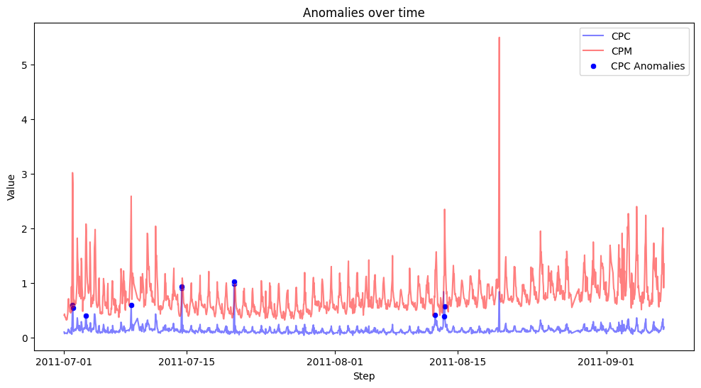
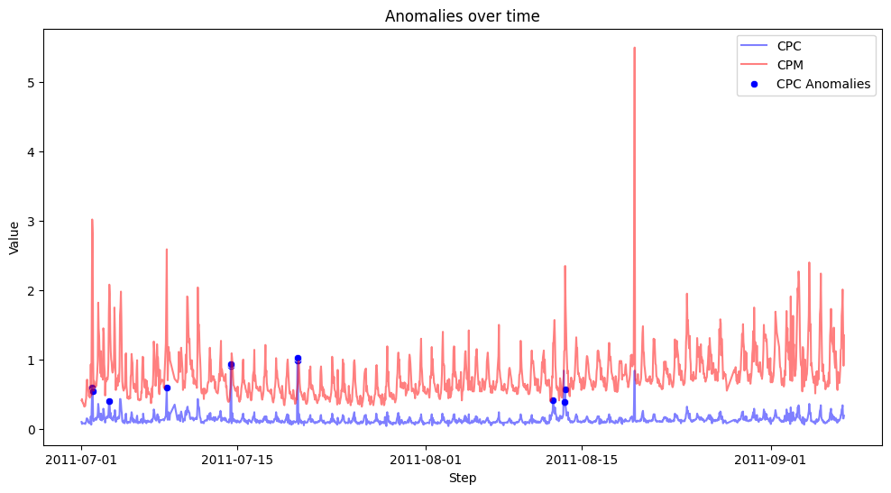

## Anomaly Detection

In this repo, we experiment with multiple anomaly detection algorithms and techniques.

Here is the work, done so far:
1. [markov chain-dummy data.py](/Scripts/markov%20chain-dummy%20data.py): Made a first order markov chain model on by-hand curated dummy data.
2. [explore-AdExchange.ipynb](/Notebooks/explore-AdExchange.ipynb): Performed basic exploration on ad-exchange record.
3. [makrov-chain-ad-data.py](/Scripts/markov-chain-ad-data.py): conducted first order markkov chain on ad records with timestamps at a steps of 1 minute. 

